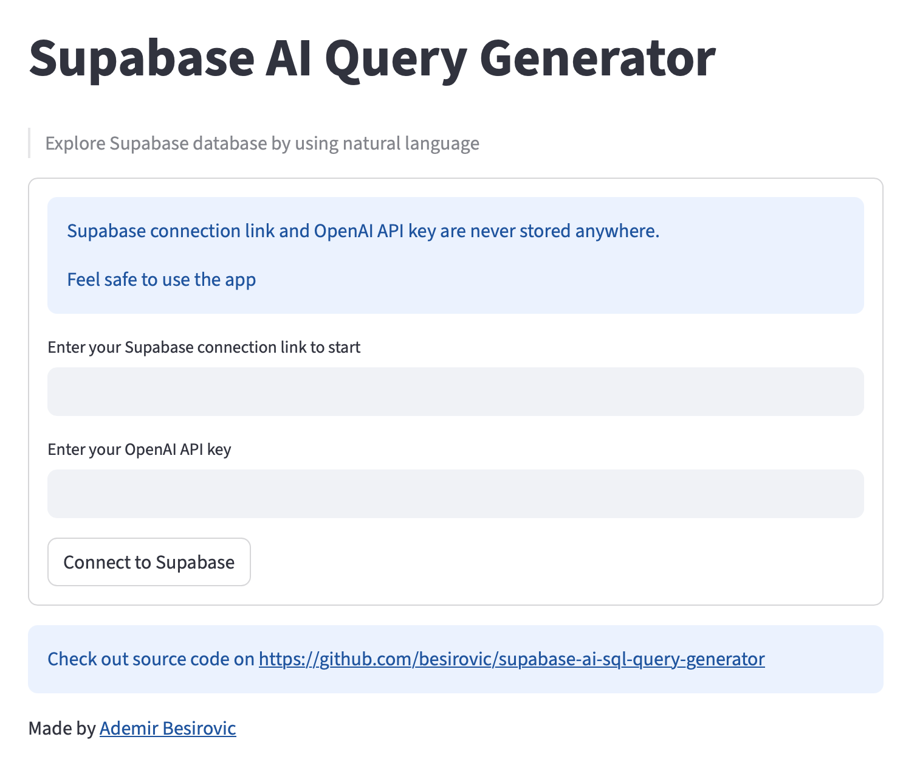
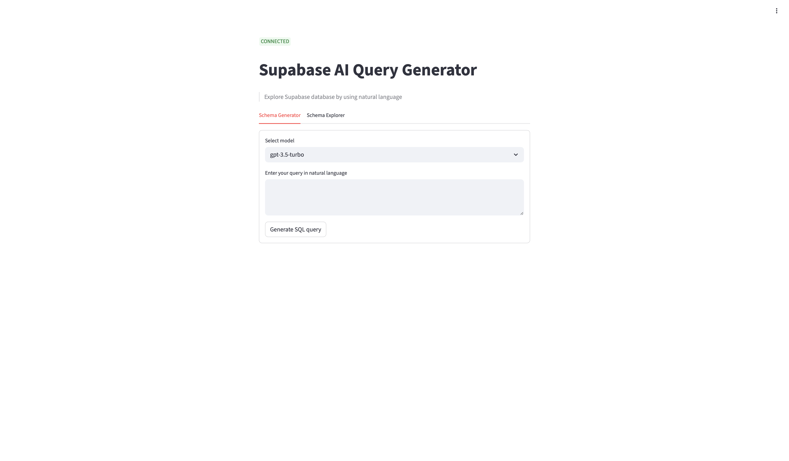
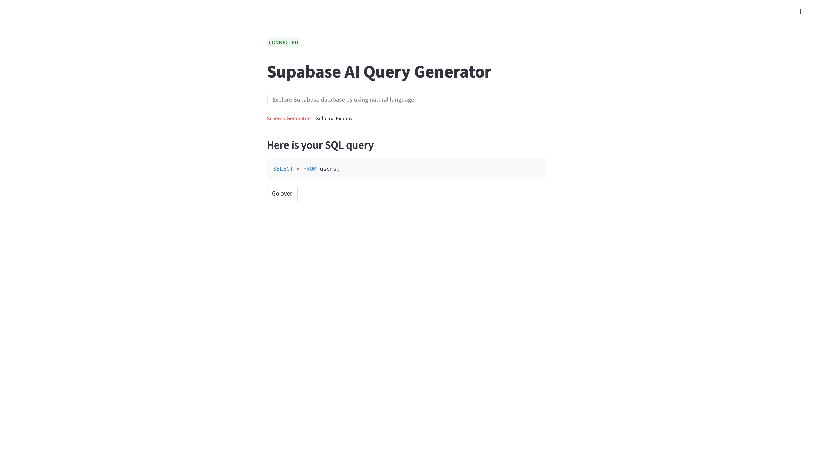

# Supabase AI SQL Query Generator

Generate SQL queries from your Supabase database just by using natural language.

Try the live version on:
[http://supabase-ai-sql-query-generator.up.railway.app](http://supabase-ai-sql-query-generator.up.railway.app)

### How it works

1. You enter your Supabase Postgress connection link and OpenAI API key
2. Use schema explorer to explore the structure of your database, tables, columns and relationships
3. Write your query/request in natural language. ie. `List me all users who have submitted feedbacks survey with the grande higher than 5`
4. Copy your query and run it inside Supabase SQL editor

### Important notes

1. Your Supabase connection link and OpenAI API **are never** stored anywhere
2. AI is instructed to always generate **only selection queries** and **never queries for updating or deleting** anything. But, **for your own security always check SQL code** before executing it in Supabase

### Screenshoot

#### Step 1 - connect to Supabase and OpenAI

#### Step 2 - Write your query/request in natural langauge

#### Step 3 - Copy your query and execute in Supabase

### Troubleshooting

In case of any bugs or issues feel free to report them to [ademir.besirovic1996@gmail.com](mailto:ademir.besirovic1996@gmail.com)
